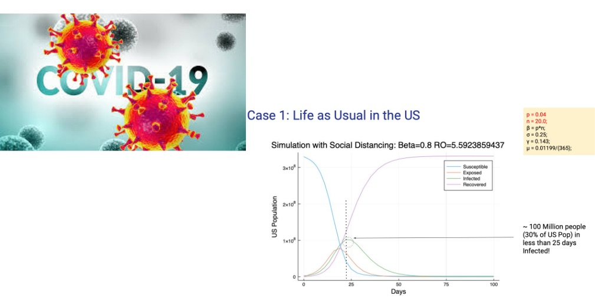

# COVID Social Distancing - Why the 10 Person Rule Mattered So Much

<p>
    
</p>

[source: COVID-19 image](https://www.google.com/imgres?q=covid&imgurl=https%3A%2F%2Ffox2now.com%2Fwp-content%2Fuploads%2Fsites%2F14%2F2020%2F03%2FCHIP-Coronavirus-COVID-19.png%3Fstrip%3D1&imgrefurl=https%3A%2F%2Ffox2now.com%2Fnews%2Fst-louis-covid-19-task-force-reports-more-than-2500-patients-discharged-home%2F&docid=unbELyPWmh7GkM&tbnid=Asdn27nEfrmjYM&vet=12ahUKEwjllvnZ0rqNAxWx4ckDHaFSOmQ4FBAzegQINxAA..i&w=1920&h=1080&hcb=2&itg=1&ved=2ahUKEwjllvnZ0rqNAxWx4ckDHaFSOmQ4FBAzegQINxAA)
## Project Description

#### Problem

During an epidemic why does reducing the size of groups matter? Why do we care how many new people we come in contact with.

#### Why it needs to be addressed

During the height of COVID, we were told that outbreaks can be reduced via social distancing. And, we were told that this social distancing meant that we needed to reduce exposure to approximately 10 people -- `The 10 People Rule`!

I wanted to understand what was the science behind the number and why was 10 so important.

#### Proposed Solution

This repository contains code examples, pdf files, IJulia notebooks, and other general materials related to calculating the rate of infectuous disease spread by mathematically modeling disease spread using differential equations for the World Health Organization's (WHO's) `S`usceptible, `E`xposed, `I`nfectious, and `R`ecovered (SEIR) Epidemic model.

Via Julia notebook experimentation, I revealed that reducing the number of contacts to `<10` of the `same` people, aoviding new people especially, and reducing the probability of infection `p` via activities like frequent hand washing, wearing a mask, avoiding eye, nose, and mouth touching are the key levers to contain and reduce the spread of epidemics because they reduce $R_0$, the **Reproduction Number** of a disease, eventually starving the disease.

#### Solution Summary

The code and examples are purely for educational purposes. The project's results were used for a Machine Learning Tech Talk for one of Akamai Technologies, Inc's mPulse team's "Learning Tuesdays" team talks, a biweekly talk given by a different member of the Akamai mPulse Data Science team.

## Tech Stack


## Getting Started

You will need to use download or clone the notebook in this repo and then install Julia and IJulia.

## Installation Steps

### Install Julia and then IJulia to use a Julia Juypter Notebook

You will need at least Julia version 1.4.0 or higher.

1. **juliaup**

A recommended way to install Julia is to install [juliaup](https://github.com/JuliaLang/juliaup) which is a small, self-contained binary that will automatically install the latest stable Julia binary and help keep it up to date. It also supports installing and using different versions of Julia simultaneously.

Install `juliaup` by running this in your terminal:

```
curl -fsSL https://install.julialang.org | sh

```

This will install the latest stable version of Julia, which can be launched from a command-line by typing `julia` as well as the `juliaup` tool. To install different Julia versions see `juliaup --help`.

2. **Downloads**
   If you want to manually download and install specific Julia versions, see the [Downloads](https://julialang.org/downloads/) page.

### Install IJulia to Use Jupyter Notebooks

Install `IJulia` using instructions [here](https://github.com/JuliaLang/IJulia.jl)

#### Running the Code

To test out the code as is. <br>

1. Run the `julia_ml_2_production_model.ipynb` notebook which will build and save
   your machine learning binary classifier model `cancer_model_jld`

2. next from a command terminal prompt run `$julia runtest.jl`. This action will
   retrieve the classifier model, start the genie.jl webserver and allow you from a browser
   or via `curl` commands to execute REST commands to the server. - for example `curl localhost:8000/sum/2/3?initial_value=10` at the command line
   will yield the value 15. This is a test to make sure all is working - `curl localhost:8000/predict` will actually run a test case of model prediction
   using a predefined benign data set of 30 features.

### Data Sources

Birth and Death Rates for the United States

```
https://www.macrotrends.net/countries/USA/united-states/population
```

Mitigation Distance and Coronavirus Cases in the US by Date

```
https://www.nytimes.com/2020/03/13/science/coronavirus-math-mitigation-distancing.html
```

Disease Reproduction Numbers

```
https://triplebyte.com/blog/modeling-infectious-diseases
```

## Final Words

Thanks for visiting.

Give the project a star (⭐) if you liked it or if it was instructional for you!

You've `beenlanced`! 😉

## Acknowledgements

I would like to extend my gratitude to all the individuals and organizations who helped in the development and success of this project. Your support, whether through contributions, inspiration, or encouragement, have been invaluable. Thank you.

Specifically, I would like to acknowledge:

- [COVID-19 image used above](https://www.google.com/imgres?q=covid&imgurl=https%3A%2F%2Ffox2now.com%2Fwp-content%2Fuploads%2Fsites%2F14%2F2020%2F03%2FCHIP-Coronavirus-COVID-19.png%3Fstrip%3D1&imgrefurl=https%3A%2F%2Ffox2now.com%2Fnews%2Fst-louis-covid-19-task-force-reports-more-than-2500-patients-discharged-home%2F&docid=unbELyPWmh7GkM&tbnid=Asdn27nEfrmjYM&vet=12ahUKEwjllvnZ0rqNAxWx4ckDHaFSOmQ4FBAzegQINxAA..i&w=1920&h=1080&hcb=2&itg=1&ved=2ahUKEwjllvnZ0rqNAxWx4ckDHaFSOmQ4FBAzegQINxAA)
- [Micke Green](https://doktormike.gitlab.io/post/covid-19/) - Covid-19 Denmark post inspiring this work for the US
- [TripleByteBlog](https://triplebyte.com/blog/modeling-infectious-diseases) - Blog posting helping to explain the SIR and SEIR Compartmental Disease Spread models.
- [U.S. Population Statistics](https://www.macrotrends.net/countries/USA/united-states/population) - U.S. Population Statistics.
- The folks at [Julialang.org](https://julialang.org/) for their installation instructions and up-to-date information on the happenings with Julia.

- [Hema Kalyan Murapaka](https://www.linkedin.com/in/hemakalyan) and [Benito Martin](https://martindatasol.com/blog) for sharing their README.md templates upon which I have derieved my README.md.

## License

This project is licensed under the MIT License - see the [LICENSE](./LICENSE) file for details
